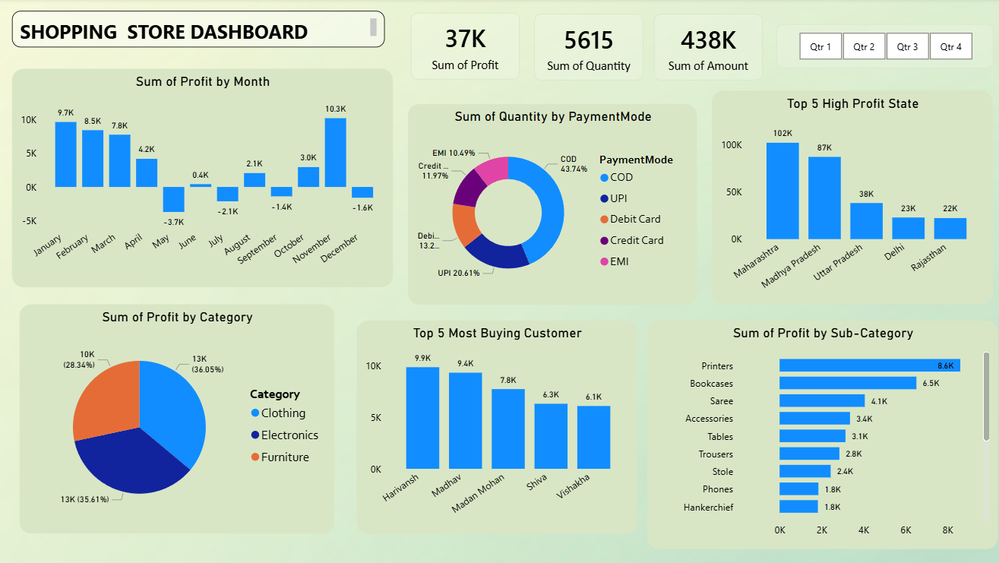

# Shopping-Store-Dashboard
Shopping Store Dashboard

An interactive **Shopping Store Dashboard** designed to analyze and visualize key business metrics such as profit, sales amount, quantity, customers, payment modes, categories, sub-categories, and state-wise performance.

The dashboard provides a clear overview of shopping store performance through interactive charts and KPI cards.

---

## 📌 Dashboard Preview

---

## 📈 Key Metrics

The dashboard displays important business KPIs including:

- 💰 **Total Profit:** 37K
- 📦 **Total Quantity:** 5,615
- 💵 **Total Sales Amount:** 438K

---

## 📊 Dashboard Features

### 1. Profit by Month
A monthly analysis of profit showing positive and negative profit trends throughout the year.

### 2. Quantity by Payment Mode
Shows the distribution of purchased quantities across different payment methods:

- COD
- UPI
- Debit Card
- Credit Card
- EMI

### 3. Top 5 High Profit States
Displays the five states generating the highest profit.

### 4. Profit by Category
Visualizes profit contribution from major product categories:

- Clothing
- Electronics
- Furniture

### 5. Top 5 Most Buying Customers
Highlights the customers with the highest purchase quantities.

### 6. Profit by Sub-Category
Shows profit generated by different product sub-categories, including:

- Printers
- Bookcases
- Saree
- Accessories
- Tables
- Trousers
- Stole
- Phones
- Handkerchief

### 7. Quarterly Analysis
The dashboard includes quarterly filters:

- Qtr 1
- Qtr 2
- Qtr 3
- Qtr 4

These filters can be used to analyze performance across different quarters.

---

## 🛠️ Tools & Technologies

This project was created using data visualization and dashboarding techniques.

**Possible tools used:**

- Power BI
- Data Visualization
- Data Analysis
- Microsoft Excel / CSV
- DAX
- Power Query

---

## 🎯 Project Objectives

The main objectives of this dashboard are to:

- Analyze overall store performance
- Track monthly profit trends
- Identify high-profit states
- Understand customer purchasing behavior
- Analyze payment method usage
- Compare product categories and sub-categories
- Identify top customers
- Provide an easy-to-understand business overview

---

## 💡 Business Insights

The dashboard can help businesses:

- Monitor profitability over time
- Identify profitable product categories
- Understand customer purchasing patterns
- Evaluate different payment methods
- Identify high-performing geographical regions
- Make data-driven business decisions

